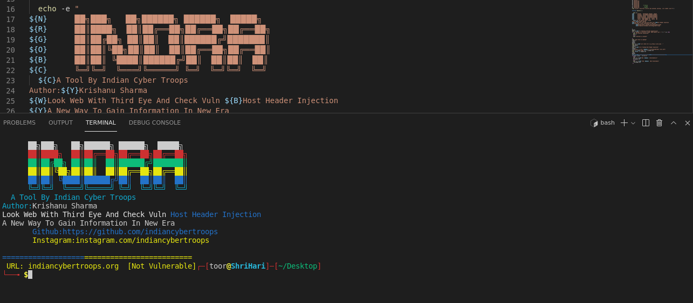

# Indra
Indra ; Tool To Find Host Header injection vuln. in webs, it's helpful for bug hunters and lightweight tool 
We Are Not Responsible For Any Damage Caused By Tool To Any Web And System We've Designed This For Educational Purpose 
If you Liked Tool Then just Star Repo And Contribute If You Can #Thanks 
Just Execute And Choose Options And Enter Site And it Will Automatically Work Results are Saved into text files you can check directory to check files 
## Designed By : K. Sharma
<p>
 <a href="https://www.youtube.com/c/indiancybertroops">
    
  </a>
    <a href="https://instagram.com/indiancybertroops">
    
  </a>
     <a href="https://t.me/indiancybertroops">
    
  </a>

</p>
   
   
### Team Indian Cyber Troops:
>Created By : Krishanu Sharma 

# Features:
>Easy to Install

>Easy to Use

>Designed In Bash(shell scripting)

>Easy To Execue

>Fastest (Based On Internet Speed)

>Low Bandwith/Data Consume
>to find Host Header Injection Vuln
>Without Brutforce(To save your valuable Time) 
# Main Indra Image

# Installation :
> clone via git clone

```
git clone https://github.com/indiancybertroops/indra
```
```
cd indra.sh
```
```
chmod +777 *
```
```
sudo bash indra.sh
```


# Github Status
[](https://github.com/indiancybertroops "Stats")<br>

## Contact Us: 


>Instagram
https://instagram.com/krishanuIND
>Instagram
https://instagram.com/Indiancybertroops


>Twitter
https://twitter.com/krishanuIND
